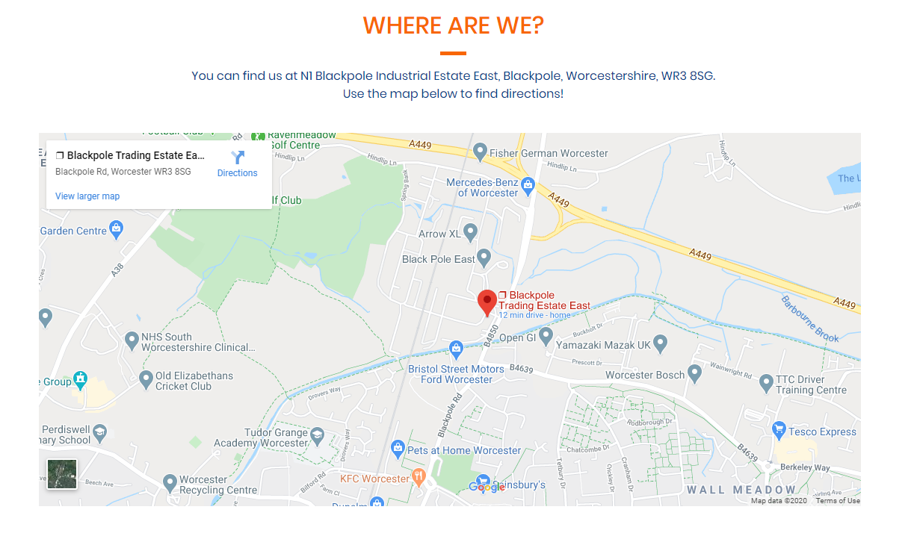
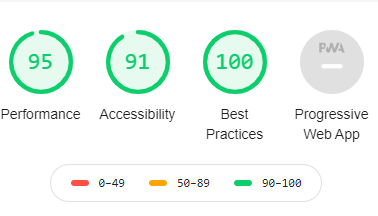

# Willmore Construction

Project One : User-Centric Frontend Development - Code Institute

Willmore Construction has been made for a company that require an update on their current website. 

It allows customers to see what type of company they are, it allows potential employees to see if they are recruiting and it allows people to see examples of their work.

## Demo
A live demo can be found [here](https://drogrinhunter.github.io/milestoneproject1/index.html).

## UX
### Who is the website for? 
The website has multiple uses, one of the uses is for customers to see what type of company they are going into business with, being able to see the services that they offer and any examples.

The other use that the website has is for people to see whether the company has any vacancies available and the ability to apply for them via the website directly. 

## Features

The website uses many different features: 
* Index - the "Home" page features a Carousel that allows the user to click through three different images with captions. This is a brief view of what the company does.
* About Us - the "About Us" page features a Google Maps API which is fully customizable to the users location. It allows them to find nearby locations that they might know to use for comparison.
    *  
* Services - the "Services" page features the different type of work that the company can provide for the customer. It features a link for customers to see examples of previous
* Recruitment - the "Recruitment" page allows potential employees to search for any roles that are available and to contact the business and send their CV in for consideration.
* Gallery - the "Gallery" page allows users to see examples of previous work done by the company. They can click on a picture as a single image whilst also allowing them to see all pictures at once.

### Features Left to Implement
In the future, I would like to add different animations to the "Gallery" page allowing for different user experiences. 

### Strategy
My goal in the design was to make it easy for people to access information whilst aiming for a minimalistic and user-friendly design.

### Scope
For customers, I wanted to provide them with a easy way to see what the company was about as well as see examples of their work which was the reason for the carousel on the index page.
For potential employees, I wanted to be able to provide them with an easy way to see whether they had any roles available hence the alert bar on the Index page.

### Structure 
In the "Services" page, I wanted customers to be able to see quickly what type of solutions the company can assist with.

### Skeleton
[Initial Wireframe](assets/images/readme-images/initial-mockup.pdf "Initial Mockup")

### Surface
The blue / orange colour scheme was chosen to allow to differentiate between title and content easily. 

## Technologies Used

- [JQuery](https://jquery.com)
    - The project uses **JQuery** to simplify DOM manipulation.
- [HTML5](https://developer.mozilla.org/en-US/docs/Web/HTML)
    - The project uses **HTML 5** for it's main content.
- [CSS](https://developer.mozilla.org/en-US/docs/Web/CSS/Reference)
    - The project uses **CSS** for it's design and styling.
- [Bootstrap](https://getbootstrap.com/)
    - The project uses **Bootstrap** for it's responsiveness for mobile design. 
- [Fancy Box](https://fancyapps.com/fancybox/3/)
    - The project uses **Fancy Box** for the gallery.
- [Font Awesome](https://fontawesome.com/)
    - The project uses **Font Awesome** for icons.

## Testing
- Home Page 
    - Carousel - this has been tested by clicking the arrows to see if image moves onto the next image. This has also been tested to ensure that the left arrows goes back an image, right arrow goes forward an image.
    - Alert Bar - There is a link to the recruitment page, this has been tested to ensure that it links to the specific page.
- About Us Page 
    - There is an API to Google Maps, this has been tested to ensure that the map loads to the location specified. It has also been tested to ensure that you can scroll on the map to zoom in and out.
- Services Page
    - There is a link to the Gallery page, this has been tested to ensure that it links to the Gallery page as specified.
- Recruitment Page 
    - There is a contact form, this has been tested by doing the below:
        - Try to submit the empty form and verify that an error message about the required fields appears
        - Try to submit the form with an invalid email address and verify that a relevant error message appears
        - Try to submit the form with all inputs valid and verify that a success message appears.
- Gallery Page
    - Fancy Box has been added for the gallery section, this has been tested to ensure that when you click an image it zooms in to one particular image. This has also been tested to ensure that the left arrows goes back an image, right arrow goes forward an image.
- Footer
    - There are social media links which have a Font Awesome icons instead of text, these have been tested to ensure that you can go to the specific website.
    - All external links open in a new tab which has been achieved by adding `target="_blank"`.

The website has been tested across multiple browsers (Google Chrome, Safari, Firefox) and on multiple mobile devices (iPhone XR, iPhone 6,7,8 Plus and iPad Mini) to ensure compatability and responsiveness.

During the testing phase, I noticed that the "Alert Bar" took up too much of the viewpoint when testing on a mobile devices, for that reason I decided not to display it on devices smaller.

I also noticed that the Maps API caused the page to not fit in the viewpoint on a mobile device so to fix it, I added a `@media` query and added the class into that query and added `display: none;` to resolve the issue.

All Jumbotron images have been removed on media devices using the `@media` query and added `display: none;` - this is due to the images appearing blurred and zoomed-in on certain media devices.

All testing has been via Google Developer Tools, as part of that testing I carried out a Google Lighthouse report, please see below for the scores.

## Deployment
The website has been hosted using GitHub pages and it has been deployed directly from the Master Branch.

Once deployed, the site will automatically update upon new commits to the Master Branch. In order for the website to deploy correctly, the landing page (Home Page) must be named `index.html`.

To run locally, the repository can be clone directly into an editor of your choice by using `git clone https://github.com/DrogrinHunter/milestoneproject1.git` in the terminal.

## Credits

### Content
Some of the content in this website has been provided by [Bourne Site Services](http://www.bournesiteservices.co.uk/) for use in this website only.
All other content has been written by myself.

### Media
Majority of the images have been taken from [Pexels](https://www.pexels.com/) which is a stock image library.
Some images have been provided by [Bourne Site Services](http://www.bournesiteservices.co.uk/) for use in this website only.

### Acknowledgements

- Carousel
    - This was provided by Bootstrap, ttutorial on how to use can be found [here](https://getbootstrap.com/docs/4.5/components/carousel/).
- Google Maps API
    - This was provided by Google/W3Schools, tutorial on how to use can be found [here](https://www.w3schools.com/graphics/google_maps_intro.asp).
- Browser Confirmation
    - This has been provided by W3Schools, tutorial on how to use can be found [here](https://www.w3schools.com/jsref/met_win_confirm.asp).
- Fancy Box
    - This has been provided by Fancy Apps, tutorial on how to use can be found [here](https://fancyapps.com/fancybox/3/).